# FanaticFi  

 

Under the new NCAA rule we are proudly presenting you FanaticFi - a new financial investment platform where investors make payments to collegiate athletes to enable them with optimal training, diet, and equipment. While these elite athletes enter drafts and sign their contracts, investors will benefit under a predetermined investment return rate.

>[click here  to](https://www.boston.com/sports/college-sports/2021/07/01/ncaa-paying-athletes-rules)  **LEARN MORE** *about NCAA's  ` New Rule ` and the effects it had on collegiate athletes*

### Data collection & clean up
---
In this project, we used NBA first round draft data from the last 5 years and analyzed the relationships between player’s stats and their contract worth. 

**Data sources are:**

* data.world
* basketball-references.com
* NBC Sports

**Aspects of analysis:**

* Positions
* Minutes per game (MPG)
* Points per game (PPG)
* Rebounds per game (RPG)
* Assists per game (APG)
* Field goal percentage (FG%)
* 3 pointer percentage (3P%)
* Free throw percentage (FT%)

**Data findings:**

>More NBA picks came from Kentucky, Duke, and UNC than other schools

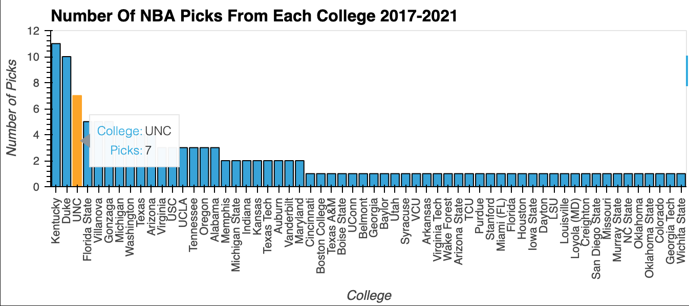

>Quality and quantity of NBA picks from top schools are declining over the last 5 years

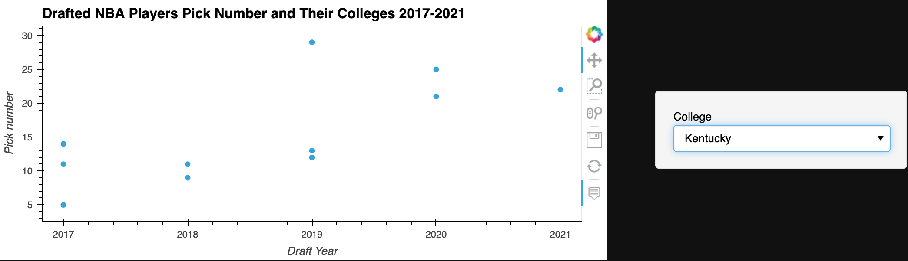

>FG%, 3P%, and FT% have higher correlation with players' contract worth than other aspects

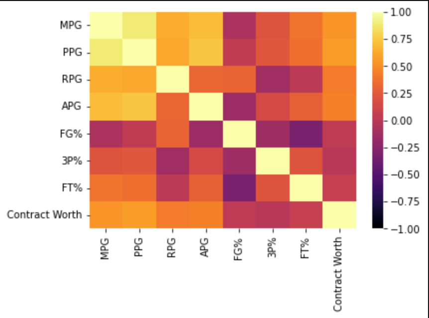

>MPG, PPG are weighted heavy by NBA teams

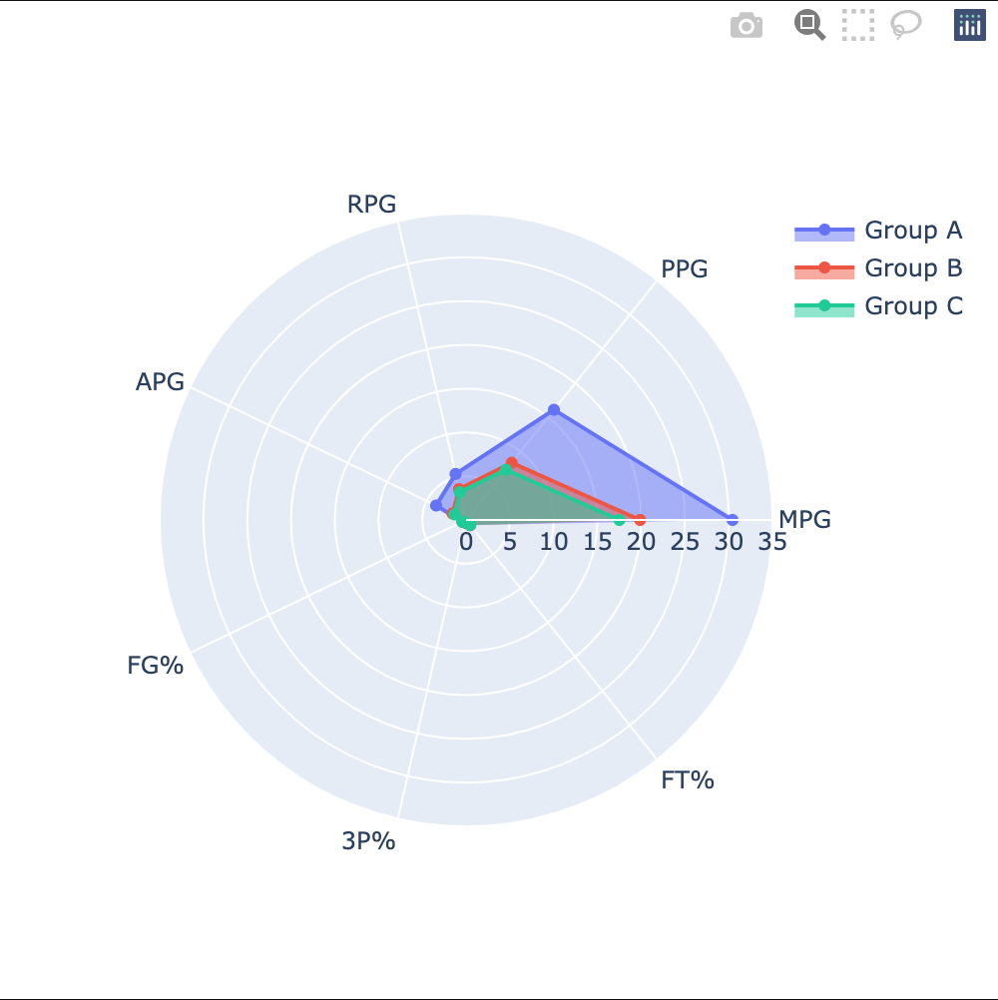

### Analysis & calculation
---
>Calculators were designed to calculate historical draftees' statistics by positions. Draftees' performances data were devided into above average, average, and below average categories.

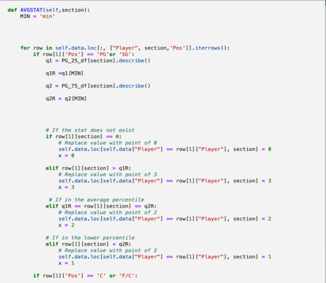

>Points were calculated for 2022 draftees by each position

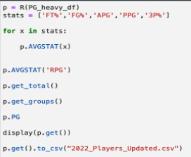

### Results & prediction
---
>Established a new data frame containing players' points and projected minimum, maximum, and mean contract range

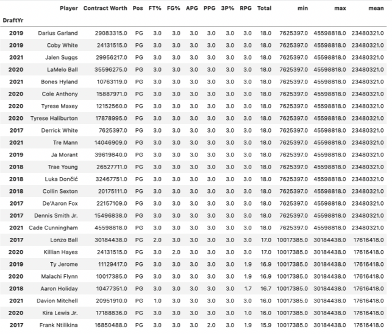

>Athletes by using our interactive application will be able to get an estimated contract range by entering in their performance statistics

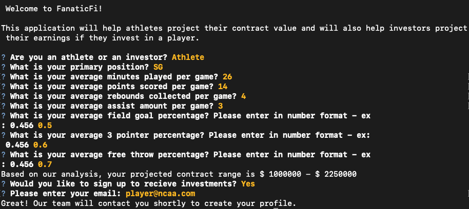

>Investors by using our interactive application will be able to choose up coming draftees to invest in based on their projected contract range and get a profit estimation

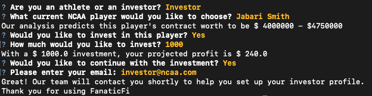

>M-inimal: the most simplistic solution

>V-iable: sufficient enough for early adopters

>P-roduct: user interactive application

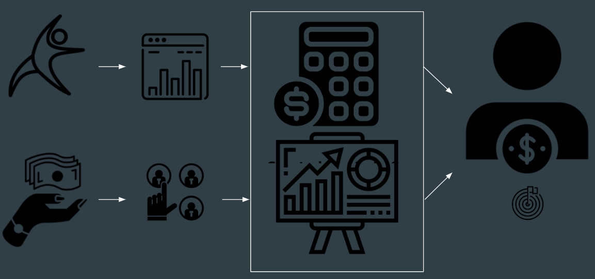

### Next steps
---
>`Include more statistics and consistency`

>`Polish CLI and calculator`

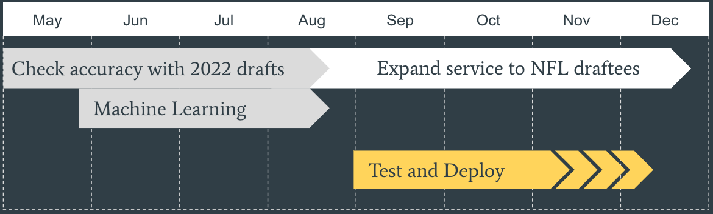

 
### Requirements
---
 *Using up to date as of 5/22/22*
 
 PYTHON 3.10 [click here](https://www.python.org/downloads/)

PANDAS [click here](https://pandas.pydata.org/pandas-docs/stable/getting_started/install.html)

PATHLIBS [click here](https://pypi.org/project/pathlib/)

JUPYTER LAB [click here](https://jupyterlab.readthedocs.io/en/stable/getting_started/installation.html)

HVPLOT [click here](https://hvplot.holoviz.org/developer_guide/index.html)

SEABORN [click here](https://seaborn.pydata.org/installing.html)

PLOTLY [click here](https://plotly.com/python/getting-started/)
 

### License
---

MIT

**Open to Experiment**

### Contributors
---
**Andrie Yanjun Lin**

[E-mail](yanjun.lin.andrie@gmail.com)  |   
[LinkedIn](https://www.linkedin.com/in/yanjun-linked)

**Arlie Jones**

[E-mail](arliejones98@gmail.com)  |  
[LinkedIn](https://www.linkedin.com/in/arlie-jones-020092159/)

**Olivia Heitzo**
* 
* 

**Robert Smith**
*
*

**Santiago Hernandez**
*
*

**CREDIT: UC BERKELEY**
